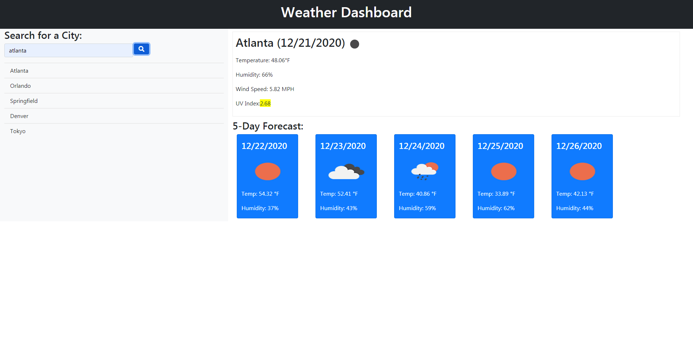

## **Weather Search**
---

#### **Table of Contents**
---
1. [Installalation](#installation)
1. [Trials](#trials)
1. [Usage](#usage)
1. [Credits](#credits)
1. [License](#license)

#### **Installation**
---
To make this project you need to do the following:

1. Position the containers so that all elements will be shown, preferably by hardcoding what you are installing before you dynamically generate.
1. Make ajax calls to openweather for current weather and for one weather call.
1. Using DOM update the containers to show the weather of the selected city.
1. Store the city selected into local data and restore the data when the section is selected.

#### **Trials**
---
This assignment helped me understand AJAX calls, and helped reinforce my usage of DOM.  In addition I learned about unix time stamps and how to use set to clear duplicate items in an array.

#### **Usage**
---
Type a city name in the search input and hit submit and the sections will be populated.  After you search the recent viewed city will be populated with the city you just looked at, and if you wish to review the info you can just click the city again.
Website is deployed [here](https://jerler1.github.io/WeatherSearch/).

#### **Credits**
---
Thanks to my class-mate Bradley for his help with getting my main function to work with the local storage values.

#### **License**
---

Copyright (c) 2005-2020 David Heinemeier Hansson

Permission is hereby granted, free of charge, to any person obtaining
a copy of this software and associated documentation files (the
"Software"), to deal in the Software without restriction, including
without limitation the rights to use, copy, modify, merge, publish,
distribute, sublicense, and/or sell copies of the Software, and to
permit persons to whom the Software is furnished to do so, subject to
the following conditions:

The above copyright notice and this permission notice shall be
included in all copies or substantial portions of the Software.

THE SOFTWARE IS PROVIDED "AS IS", WITHOUT WARRANTY OF ANY KIND,
EXPRESS OR IMPLIED, INCLUDING BUT NOT LIMITED TO THE WARRANTIES OF
MERCHANTABILITY, FITNESS FOR A PARTICULAR PURPOSE AND
NONINFRINGEMENT. IN NO EVENT SHALL THE AUTHORS OR COPYRIGHT HOLDERS BE
LIABLE FOR ANY CLAIM, DAMAGES OR OTHER LIABILITY, WHETHER IN AN ACTION
OF CONTRACT, TORT OR OTHERWISE, ARISING FROM, OUT OF OR IN CONNECTION
WITH THE SOFTWARE OR THE USE OR OTHER DEALINGS IN THE SOFTWARE.

